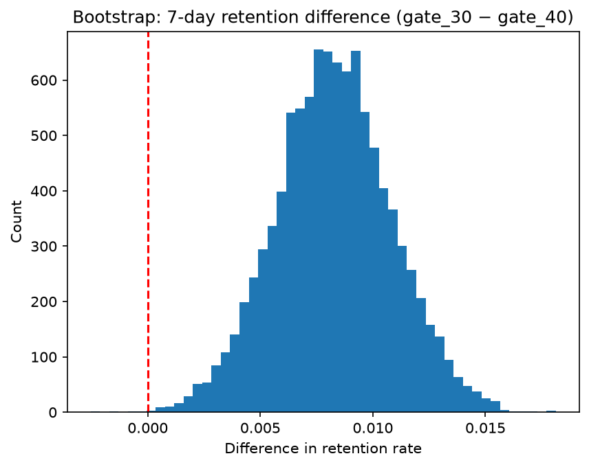

# Cookie Cats A/B Test: Does Moving the Gate Affect Player Retention?
  
  # Summary
  I looked at data from about 90,000 players of a mobile game to see if delaying a "wait gate" from level 30 to level 40 would keep more players coming back. After cleaning the data with SQL and testing the results with both a z-test and 10,000 bootstrap simulations, I found the opposite of what the change was hoping for: moving the gate later lowered 7-day retention from 19.0% to 18.2%, a difference that was very unlikely to be due to chance. The 1-day difference was small and not significant. Because even a small drop adds up to many lost players for a large game, I recommended keeping the gate at level 30.
  
  ## Question
  Does moving the first in-game gate from level 30 to level 40 change player retention?
  
  ## Result
  - 7-day retention: 19.0% vs 18.2%, z-test p = 0.0016, 95% CI 0.31–1.33 points
  - Bootstrap (10,000 resamples): 95% CI 0.32–1.34 points; gate_30 higher in >99.9% of resamples
  - 1-day retention: 44.8% vs 44.2%, p = 0.07 (not significant)
   
  
  ## Data cleaning
  - No duplicate user IDs
  - Removed 1 player with 49,854 game rounds (implausible: ~3,500 rounds/day); analysis uses 90,188 players
  
  ## Method
  1. SQL exploration (DuckDB): group sizes, play statistics, retention rates
  2. Validity check: sample ratio (chi-square)
  3. Hypothesis tests on 1-day and 7-day retention (two-proportion z-test)
  4. Bootstrap confidence intervals
  5. Engagement comparison (Mann-Whitney U)
  
  ## Results
  Outlier removed: gate_30 now has 44,699 players with a max of 2,961 rounds. The gate_30 average dropped from 52.46 to 51.34, now almost identical to gate_40's 51.30.
  Retention is basically unchanged by the cleaning: 1-day 44.8% vs 44.2%; 7-day 19.0% vs 18.2%.
  - Game rounds played (Mann-Whitney U test, used because the data is heavily skewed): p = 0.051, not significant (borderline); medians 17 vs 16
  
  ## Recommendation
  Keep the gate at level 30.
  
  ## Limitations
  The test wasn't completely flawless. The groups weren't an exact 50/50 split (49.6% vs 50.4%, chi-square p ≈ 0.009), which could mean a small problem in how players were assigned, so the results should be read with that in mind. I also removed one player with 49,854 game rounds — likely a bot or data error — who would have skewed the numbers. Finally, I only had short-term retention (1-day and 7-day). A real gaming company would also want to track longer-term habits, like 30-day retention, and how much money players actually spend.
  
  ## How to run
  1. Download the dataset from Kaggle into `data/`
  2. `python3 -m venv .venv && source .venv/bin/activate`
  3. `pip install duckdb pandas numpy scipy matplotlib statsmodels jupyter`
  4. Open `analysis.ipynb` and run all cells
